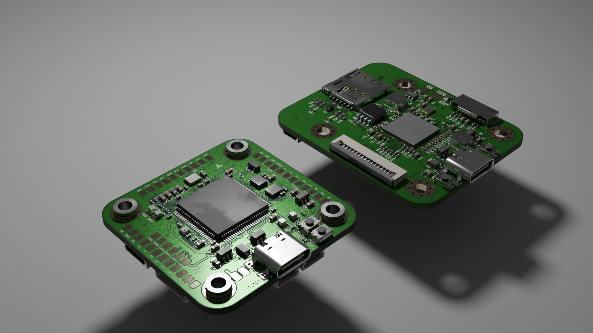
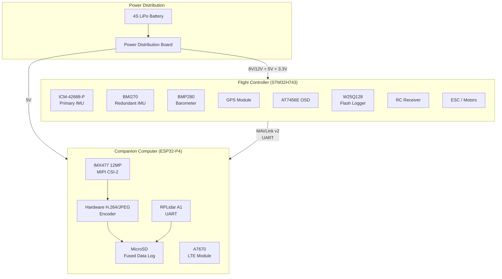
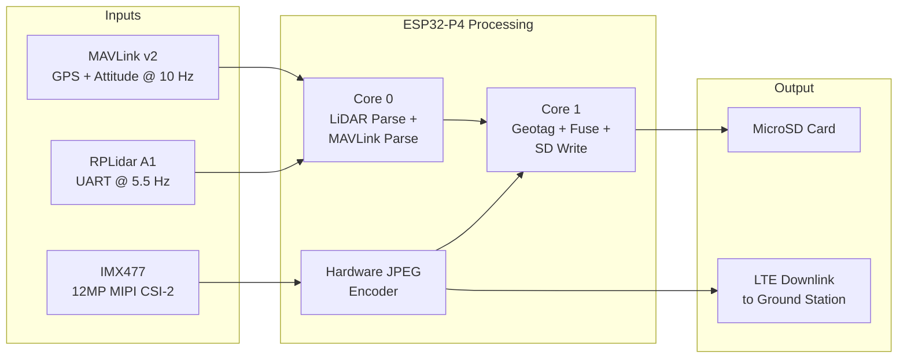
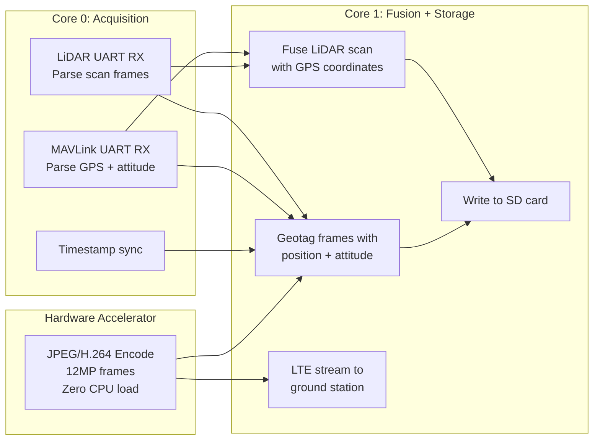
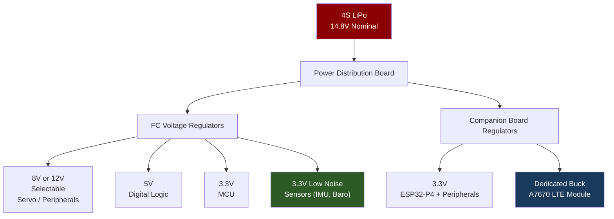
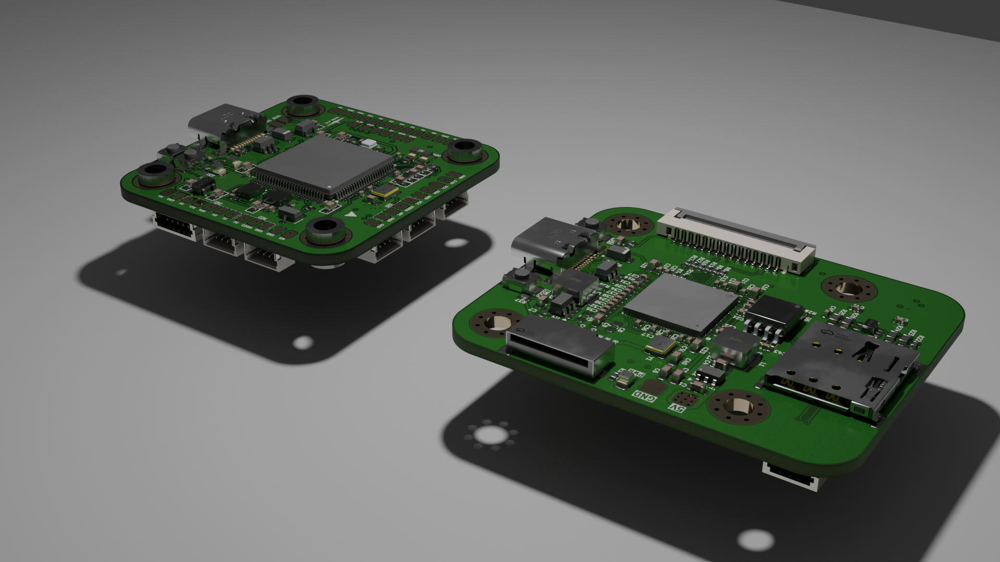
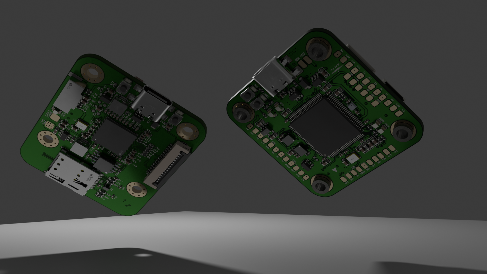
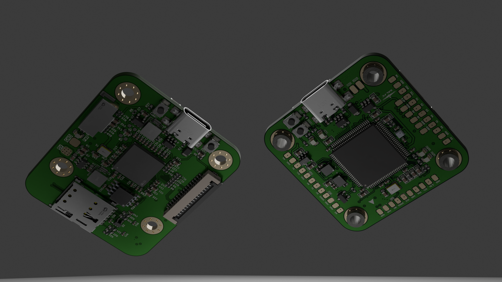
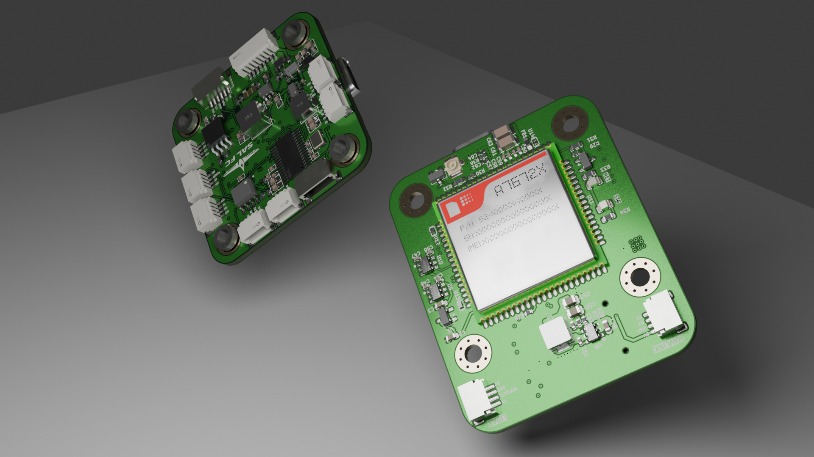

# Autonomous Aerial Mapping System


Full-stack UAV avionics platform for autonomous aerial survey and photogrammetric 3D reconstruction. Two custom multilayer PCBs designed in KiCad, hand-soldered, and validated on a physical airframe: an STM32H743 flight controller with dual redundant IMUs and a custom ArduPilot port, paired with an ESP32-P4 companion computer for synchronized 12MP image capture and 2D LiDAR acquisition with real-time LTE downlink.



## Overview

This project implements a complete UAV avionics stack built from scratch for aerial mapping and search-and-rescue applications. The system captures high-resolution geotagged imagery and LiDAR terrain profiles simultaneously during flight, fuses them with flight controller attitude and GPS data via MAVLink v2, and logs everything to SD card for post-flight photogrammetric 3D reconstruction.

The flight controller board handles all flight-critical functions: stabilization, navigation, RC control, and MAVLink telemetry output. The companion computer board operates independently on its own power rail, receiving only UART telemetry from the FC, and handles all payload data acquisition, sensor fusion, encoding, and logging.

Both boards conform to the 30.5mm drone stack mounting standard and draw power from a common 4S LiPo through a power distribution board, with fully independent voltage regulation on each board.

## Key Specifications

### Flight Controller (SALEHFC)

| Parameter | Value |
|---|---|
| MCU | STM32H743, ARM Cortex-M7 @ 480 MHz |
| IMU 1 | ICM-42688-P (primary) |
| IMU 2 | BMI270 (redundant) |
| Barometer | BMP280 |
| OSD | AT7456E |
| Flash Logging | W25Q128 (16 MB) |
| Firmware | ArduPilot / INAV (custom target) |
| Telemetry | MAVLink v2 over UART |
| Mounting | 30.5 x 30.5 mm |
| Design Rules | IPC-2221 |

### Companion Computer

| Parameter | Value |
|---|---|
| MCU | ESP32-P4, Dual-core RISC-V @ 400 MHz |
| Camera | IMX477 (12 MP) via MIPI CSI-2 |
| LiDAR | RPLidar A1 (8000 samples/sec, up to 10 Hz scan rate) |
| Encoding | Hardware H.264/JPEG (1080p @ 30fps, zero CPU load) |
| Cellular | A7670 LTE module |
| Storage | MicroSD (geotagged frames + LiDAR logs) |
| FC Link | MAVLink v2 over UART |
| Input Voltage | 5V from PDB |
| Mounting | 30.5 x 30.5 mm |
| Design Rules | IPC-2221 |

## System Architecture



## Data Fusion Pipeline



## Firmware Architecture

### Flight Controller

The STM32H743 runs a custom-built ArduPilot (or INAV) target with a board definition, bootloader, and HAL pin mapping written from scratch. Key functions:

- Sensor fusion across dual redundant IMUs with automatic failover
- GPS-guided autonomous waypoint navigation
- MAVLink v2 telemetry output to companion computer at 10 Hz
- RC override and failsafe handling
- OSD overlay and onboard flash logging

### Companion Computer

The ESP32-P4 firmware runs on both RISC-V cores with a clear task separation:



## Power Architecture



The flight controller and companion computer have fully independent power regulation with power protection on every rail across both boards. The companion board expects 5V input from the PDB and regulates down to 3.3V for the ESP32-P4 and peripherals, with a dedicated buck converter supplying the A7670 LTE module on its own isolated rail. The FC provides a selectable 8V/12V rail for servos and peripherals, plus dedicated 5V, 3.3V, and a low-noise 3.3V rail isolated for the IMUs and barometer to minimize sensor noise.

No power dependency exists between the two boards. The companion board receives only UART data from the FC, ensuring a failure on the companion side cannot affect flight-critical systems.

## Hardware

### Flight Controller PCB




### Companion Computer PCB




### Assembled Stack


## EMI/EMC Validation

Both boards underwent pre-fabrication electromagnetic simulation in OpenEMS with FreeCAD integration. Simulation targets included:

- Signal integrity on high-speed MIPI CSI-2 differential pairs
- Emission compliance around the LTE antenna feed
- Ground plane continuity and return path analysis
- Decoupling capacitor placement optimization for the sensor power rail

Antenna matching on the companion board was informed by prior LTE RF layout experience from a production Modbus RTU pump controller deployment.

## Post-Flight Workflow

1. Remove SD card from the companion board after landing
2. Import geotagged JPEG frames and LiDAR scan logs into photogrammetry software (Agisoft Metashape, Pix4D, or OpenDroneMap)
3. Camera imagery produces dense 3D point clouds and textured mesh through multi-view photogrammetry
4. LiDAR terrain profiles supplement the model with accurate elevation data
5. Output: georeferenced 3D reconstruction for survey, inspection, or search-and-rescue applications

## Project Status

| Component | Status |
|---|---|
| Flight Controller PCB | Fabricated, assembled, and flight-tested |
| FC Firmware (ArduPilot/INAV) | Custom target validated with live sensor fusion and RC control |
| Companion Computer PCB | Design complete, renders finalized, awaiting fabrication |
| Companion Firmware | In development |
| System Integration | Pending companion board fabrication |

## Repository Contents

```
├── Renders/
│   ├── AU2.png
│   ├── AU3.png
│   ├── AU4.png
│   └── AU5.png
├── Images/
│   ├── assembled_stack.jpg
│   ├── scope_captures/
│   └── test_results/
└── README.md
```